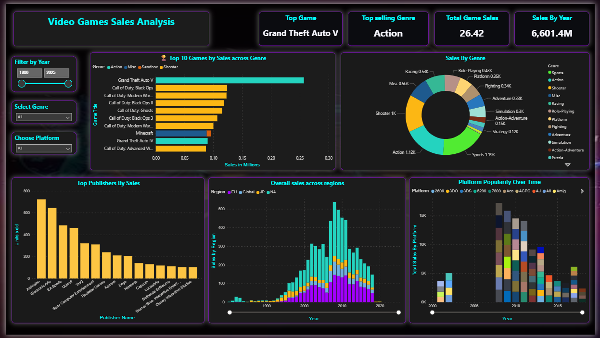
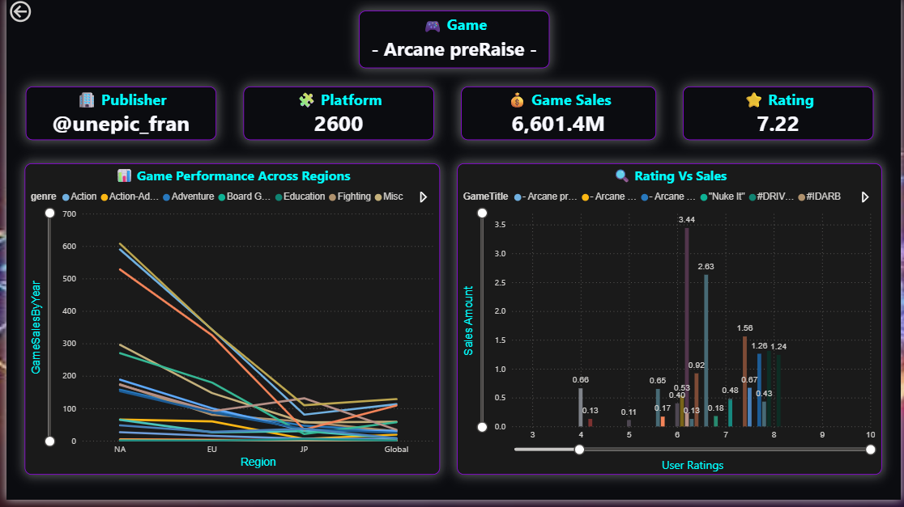
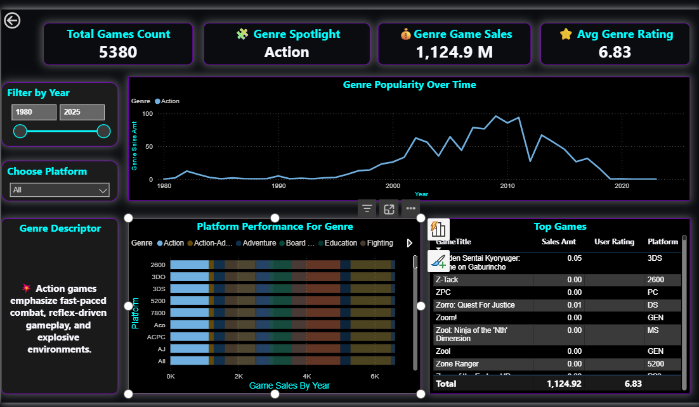
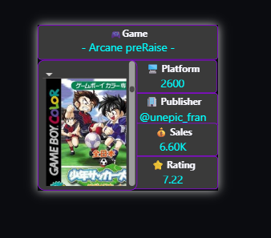

# 🎮 Video Game Genre Dashboard – Power BI Project

This dashboard explores global game sales, genre trends, platform performance, and top titles—built in Power BI using drillthrough pages and DAX-powered KPIs.

## 🔍 KPIs Tracked
- 💰 Total Sales per Genre
- 🎮 Game Count by Category
- ⭐ Average Ratings
- 📈 Genre Popularity Over Time
- 🏆 Top Games by Sales and Score

## 📘 Insights Discovered
- Action games peaked in 2004 with massive sales
- Puzzle & Casual genres surged via mobile platforms
- RPGs performed stronger on consoles vs PC

## 🧠 What I Learned
- Drillthrough design enhances storytelling
- Emoji and badges boost visual clarity
- DAX unlocked dynamic genre descriptors

## 📸 Dashboard Previews

---

✨ Built by [Vaishnavi](https://www.linkedin.com/in/your-link/)  
📊 #PowerBI #GamingAnalytics #DashboardDesign